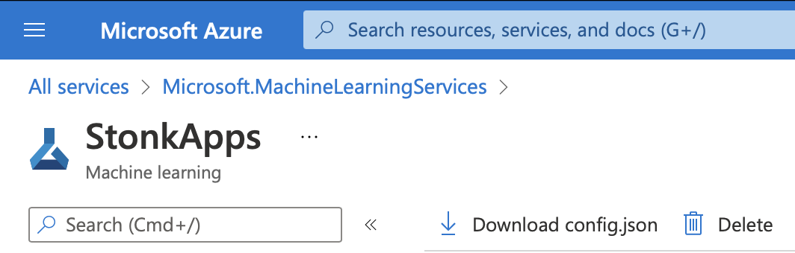

# Облачные технологии: Курсовая
Distributed training with PyTorch and AzureML.

## Prerequisites

1. Download ```config.json``` from AzureML workspace and copy to the root of this project.


### Devcontainer (Recommended)
2. In VSCode open Command Palette and run ```Rebuild and Reopen in DevContainer``` or build your own image using ```Dockerfile```.

### Local
2. Install python packages
```bash
pip install -r requirements.txt
```

3. Authentication
```bash
az login
```

## Usage
Sample
```bash
# Download dataset
python3 load_cifar10.py

# Run training job
python3 job.py --config cifar_single_test
```

## TODO:
- [ ] Добавить модель из ноутбука на Kaggle
- [ ] Загрузка датасета Intel (load_intel.py + preprocessing)
- [x] Добавить аргументы для запуска job.py (script_name, experiment_name, cluster_name, epochs, ...)
- [ ] Добавить валидацию модели на каждой эпохе обучения
- [ ] Добавить отписывание графика с результатами обучения (loss, accuracy, etc..) в .png
